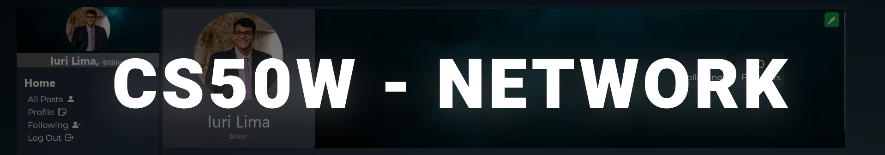

# 📱 Project 4 : Django + JavaScript - Social Network


## 📝 Descrição
Este projeto é uma rede social desenvolvida com Django, Javascript, Tailwindcss e a biblioteca Pillow do Python, onde os usuários podem criar posts, seguir outros usuários, e "curtir" posts. A aplicação utiliza um banco de dados para armazenar todas as informações sobre usuários, posts, seguidores e curtidas.

## 🛠️ Funcionalidades
### 📚 Modelos
O projeto utiliza um modelo de dados para representar usuários, posts, seguidores e curtidas. Cada modelo armazena as informações necessárias para as funcionalidades da rede social, como usuários, conteúdos de posts, relacionamentos de seguidores e status de curtidas.

### 📝 Novo Post
- URL: `create_post/`
- Descrição: Permite aos usuários autenticados criar um novo post preenchendo um campo de texto e clicando em um botão para enviar o post. O post é salvo no banco de dados e exibido no feed de posts.

### 📰 Todos os Posts
- URL: `/`
- Descrição: Exibe todos os posts de todos os usuários, ordenados em ordem cronológica inversa. Cada post inclui o nome de usuário do autor, o conteúdo do post, a data e hora de criação, e o número de "curtidas".

### 🧑‍💼 Página de Perfil
- URL: `/profile/<str:username>`
- Descrição: Exibe a página de perfil de um usuário, mostrando o número de seguidores, o número de pessoas que o usuário segue e todos os posts do usuário, ordenados em ordem cronológica inversa. Usuários autenticados podem seguir ou deixar de seguir outros usuários.

### 👥 Seguindo
- URL: `/following`
- Descrição: Exibe todos os posts feitos pelos usuários que o usuário atual segue. Esta página se comporta como a página de todos os posts, mas com um conjunto mais limitado de posts. Disponível apenas para usuários autenticados.

### 🔄 Paginação
- Descrição: Em qualquer página que exibe posts, os posts são exibidos em páginas de 10 posts cada. Se houver mais de 10 posts, um botão "Próximo" aparece para levar o usuário à próxima página de posts. Um botão "Anterior" aparece se não estiver na primeira página.

### ✏️ Editar Post
- Descrição: Usuários podem clicar em um botão "Editar" em qualquer um de seus próprios posts para editar o conteúdo do post. A edição é feita de forma assíncrona usando JavaScript.

### ❤️ "Curtir" e "Descurtir"
- Descrição: Usuários podem clicar em um botão para "curtir" ou "descurtir" qualquer post. A atualização do número de curtidas é feita de forma assíncrona usando JavaScript.

## 📂 Estrutura do Projeto
- `project4/`: Diretório principal do projeto Django.
    - `network/`: Aplicativo Django contendo:
        - `templates/network/`: Templates HTML para as páginas do site.
        - `static/network/`: Arquivos CSS e JS.
        - `urls.py`: Configuração de URLs.
        - `views.py`: Lógica das views.
        - `models.py`: Definição dos modelos de dados.

## 🗺️ Rotas do Projeto
### Rotas Principais
- `index`: path("", views.index, name="index")
- `login`: path("login/", views.login_view, name="login")
- `logout`: path("logout/", views.logout_view, name="logout")
- `register`: path("register/", views.register, name="register")

### Rotas da API
- `posts`: path("posts", views.posts, name="posts")
    - Envia um novo post criado pelo usuário ou obtém posts existentes.

- `profile`: path("profile/<str:username>", views.profile, name="profile")
    - Recupera os detalhes do perfil de um usuário específico.

- `follow`: path("follow/<str:username>", views.follow, name="follow")
    - Segue ou deixa de seguir um usuário específico.

## 📡 API
- `GET` /posts
    - Descrição: Retorna uma lista de todos os posts em formato JSON, paginada.
- `POST` /posts
    - Descrição: Envia um novo post com o conteúdo especificado.
- `GET` /profile/<str:username>
    - Descrição: Retorna os detalhes do perfil de um usuário específico, incluindo posts e status de seguidores.
- `PUT` /posts/<int:post_id>
    - Descrição: Atualiza o conteúdo de um post específico.
- `PUT` /posts/<int:post_id>/like
    - Descrição: Atualiza o status de curtida de um post específico (curtir/descurtir).

## 🚀 Guia de Inicialização
### 1️⃣ Clone o Repositório
```sh
git clone <url_do_repositorio>
```
### 2️⃣ Instale Dependências
```sh
pip install -r requirements.txt
```

### 3️⃣ Configure o Banco de Dados
```sh
python manage.py makemigrations network
python manage.py migrate
```
### 4️⃣ Crie um Superusuário
```sh
python manage.py createsuperuser
```

### 5️⃣ Inicie o Servidor Django
```sh
python manage.py runserver
```

### 6️⃣ Navegue e Interaja
 - 🌐 Abra o navegador e acesse http://127.0.0.1:8000
 - 📝 Registre uma nova conta ou faça login com uma conta existente.
 - 📱 Crie, edite e interaja com posts.
 - 🔧 Use a interface de administração para gerenciar dados do site.

## 📚 Considerações Finais
Este projeto fornece uma rede social completa utilizando Django e JavaScript. O foco principal é a integração entre o front-end dinâmico, gerenciado por JavaScript, e o back-end robusto provido por Django, permitindo uma experiência de usuário fluida e eficiente.

# Licença 📜

This project is licensed under the MIT License. See the [LICENSE](https://opensource.org/license/mit) file for more information.

